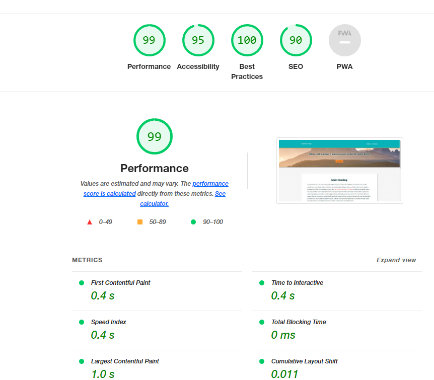

# m10-hw10-christensen-kristine
Assignment 10: Create a Webpage with Organized CSS Styles
## About This Assignment ##
1.	Convert all existing CSS selectors to BEM classes.
2.	Follow BEM best practices:
3.	Preserve the existing styling and behavior of the site through your changes.

## Lighthouse Report ##
